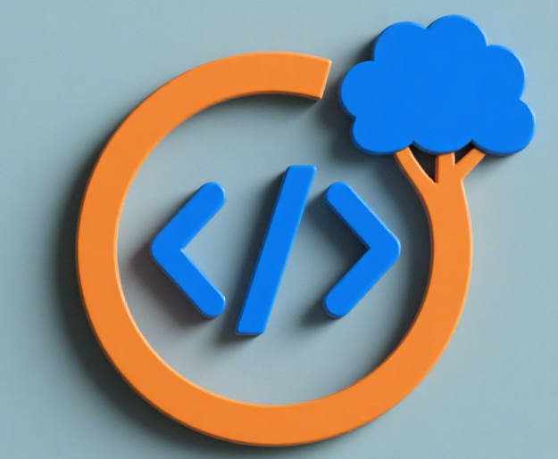

# 大龄程序员成长智库 & 自救指南

[ENGLISH README](README-en.md)

## 项目简介
这是一个面向35+大龄程序员的开源成长智库与自救指南项目。我们聚焦于大龄程序员在职业发展中面临的困境与挑战，汇集行业经验、转型策略、技能升级路径及心态调整方法，旨在帮助大龄程序员突破职业瓶颈，实现可持续发展。

无论你正面临"年龄焦虑"、职业转型困惑，还是希望在技术深耕中找到新方向，这里都能为你提供实用的参考与支持。

## 核心内容板块
### 1. 职业困境解析
- 大龄程序员常见的职场挑战（晋升瓶颈、技术迭代压力、家庭与工作平衡等）
- 行业对大龄程序员的认知误区与真相
- 不同技术领域（前端/后端/算法/架构等）的大龄职业发展特点

### 2. 技能升级路径
- 技术深耕方向：如何从"全而不精"到"一专多强"
- 跨界技能补充：管理、产品、业务分析等能力的培养方法
- 新兴技术与传统技术的平衡策略（避免盲目追新，发挥经验优势）

### 3. 转型策略库
- 技术转管理的实操指南（从技术骨干到团队leader的能力跃迁）
- 技术转产品/运营/售前的适配性分析与转型步骤
- 自由职业/独立开发/技术创业的可行性方案
- 跨行业技术应用的机会挖掘（如传统企业数字化转型需求）

### 4. 心态与认知调整
- 如何克服年龄焦虑与自我怀疑
- 建立可持续的职业发展观（拒绝"35岁淘汰论"陷阱）
- 大龄程序员的核心竞争力重构（经验、稳定性、行业洞察的价值释放）

### 5. 实战案例库
- 真实大龄程序员的转型成功案例（附具体路径与方法论）
- 失败案例的反思与避坑指南
- 不同城市/企业类型（大厂/中小厂/外企）的大龄程序员生存状态对比

## 如何参与
- **贡献内容**：如果你有相关经验或见解，欢迎提交PR补充案例、方法或观点
- **问题讨论**：在Issues中提出你的困惑或建议，社区将共同探讨解决方案
- **分享传播**：将项目分享给有需要的同行，让更多大龄程序员受益

## 许可证
本项目采用 [MIT License](LICENSE) 开源协议，允许自由使用、修改和传播。

## 寄语
年龄不是职业的天花板，而是经验的护城河。在这里，我们拒绝焦虑，专注成长，一起找到属于大龄程序员的可持续发展之路。
